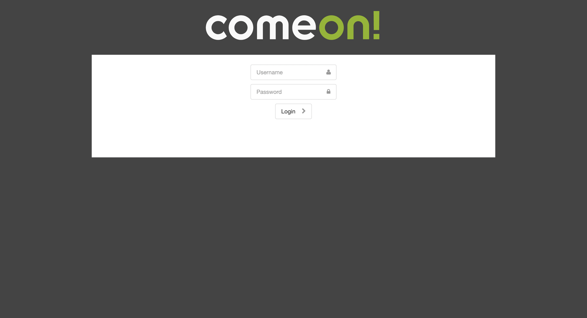
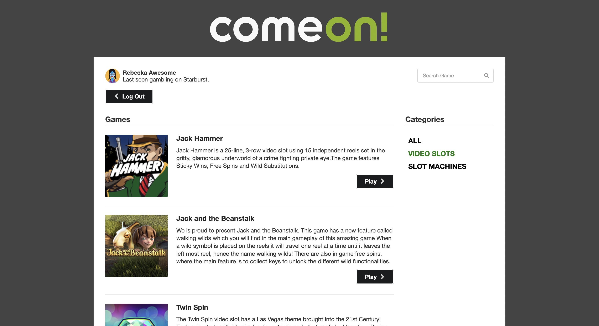
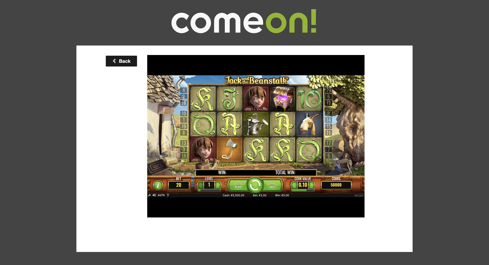

## Game Webapp

-Built React with semanticUI.
-Atomic Design Pattern used for components.
-This project contains Prettier & Eslint configs.
-Login/Logout with localdb
-Global state management with Zustand

### `npm install` && `npm start` => App runs on http://localhost:3000
### `npm install -g json-server`
### `json-server --watch mock/mock-data.json --port 3001 --middlewares mock/mock-api.js` => mockdb runs on http://localhost:3001
## Screenshots

